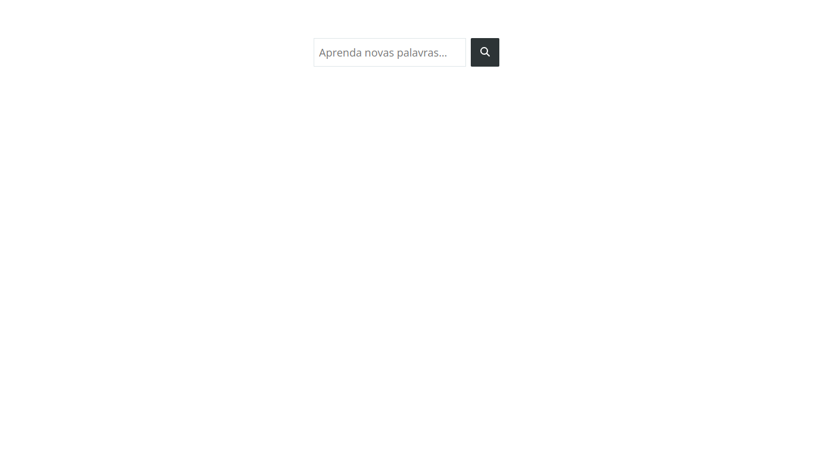

# dict-ts

## Sumário

- [dict-ts](#dict-ts)
  - [Sumário](#sumário)
  - [Motivação](#motivação)
  - [Pilha de tecnologia](#pilha-de-tecnologia)
  - [Galeria](#galeria)
  - [Como rodar](#como-rodar)
    - [Pré-requisitos](#pré-requisitos)
    - [Passo a passo](#passo-a-passo)

## Motivação

Este app consiste em um dicionário de palavras em língua inglesa utilizando a API [Free Dictionary](https://dictionaryapi.dev/). O app, como exemplificado pelas [figuras abaixo](#galeria), exibe todas as classes gramaticais de uma palavra cadastrada em sua base de dados, um ou mais exemplos práticos para cada classe gramatical e uma lista de sinônimos e antônimos para cada exemplo prático.

O repositório de código oficial da API está disponível [aqui](https://github.com/meetDeveloper/freeDictionaryAPI).

Este foi o primeiro repositório de código apresentado no [Curso Superior de TSI do IFMS](https://www.ifms.edu.br/campi/campus-aquidauana/cursos/graduacao/sistemas-para-internet/sistemas-para-internet) como requisito para obtenção da nota parcial das atividades da unidade curricular Construção de Páginas Web III.

## Pilha de tecnologia

As seguintes tecnologias foram utilizadas para desenvolver este app:

| Papel | Tecnologia |
|-|-|
| Ambiente de execução | [Node](https://nodejs.org/en/) |
| Linguagem de programação | [TypeScript](https://www.typescriptlang.org/) |
| Ambiente de desenvolvimento | [Vite](https://vitejs.dev/) |
| Biblioteca de interface de usuário | [React](https://pt-br.reactjs.org/) |
| Prototipagem | [Microsoft Paint](https://apps.microsoft.com/store/detail/paint-3d/9NBLGGH5FV99?hl=pt-br&gl=br) |
| Base de dados | [Free Dictionary](https://dictionaryapi.dev/) |

## Galeria




## Como rodar

### Pré-requisitos

- [Node](https://nodejs.org/en/download/);
- [Yarn](https://yarnpkg.com/) (opcional).

### Passo a passo

1. Clone o repositório de código em sua máquina;
   
2. Abra um shell de comando de sua preferência (prompt de comando, PowerShell, terminal _etc_.);
   
3. Instale as dependências do projeto através do seguinte comando:

```console
$ npm install
```

Caso esteja utilizando o gerenciador de pacotes Yarn, execute o seguinte comando como alternativa:

```console
$ yarn
```

4. Finalmente, execute o seguinte comando para iniciar o app:

Para npm:

```console
$ npm run dev
```

Para Yarn:

```console
$ yarn dev
```